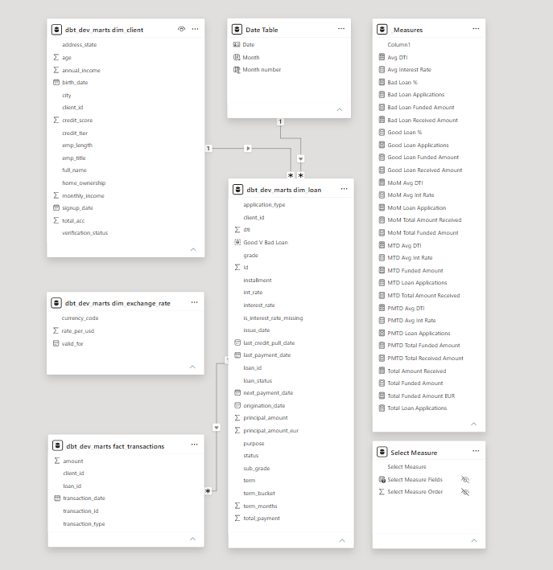
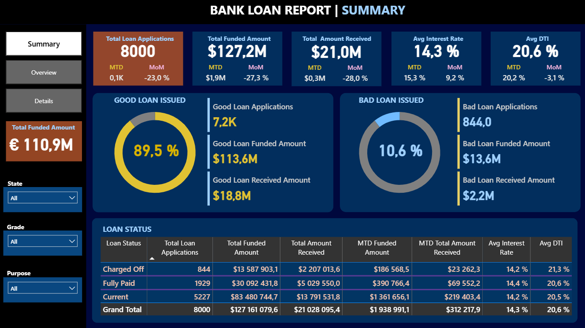
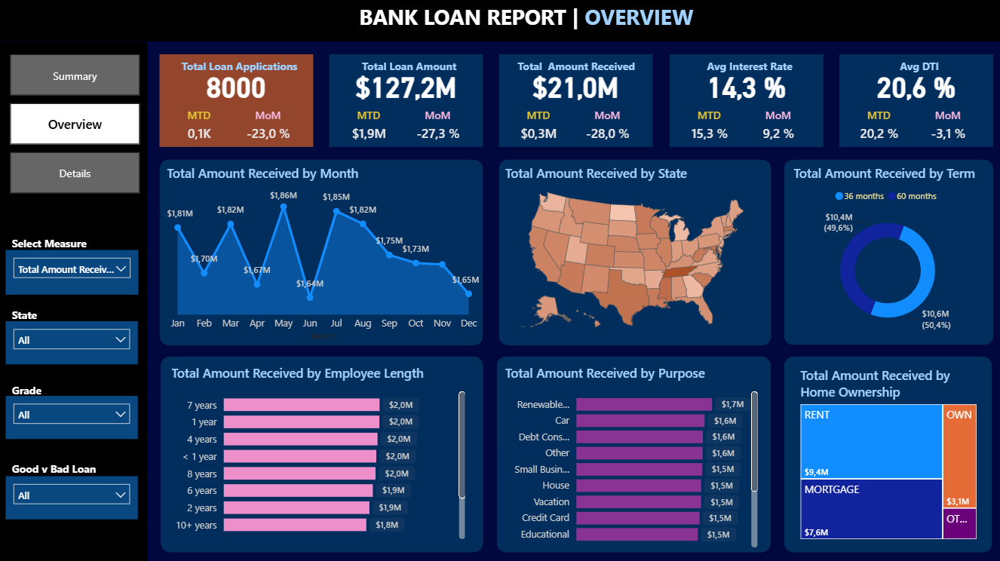
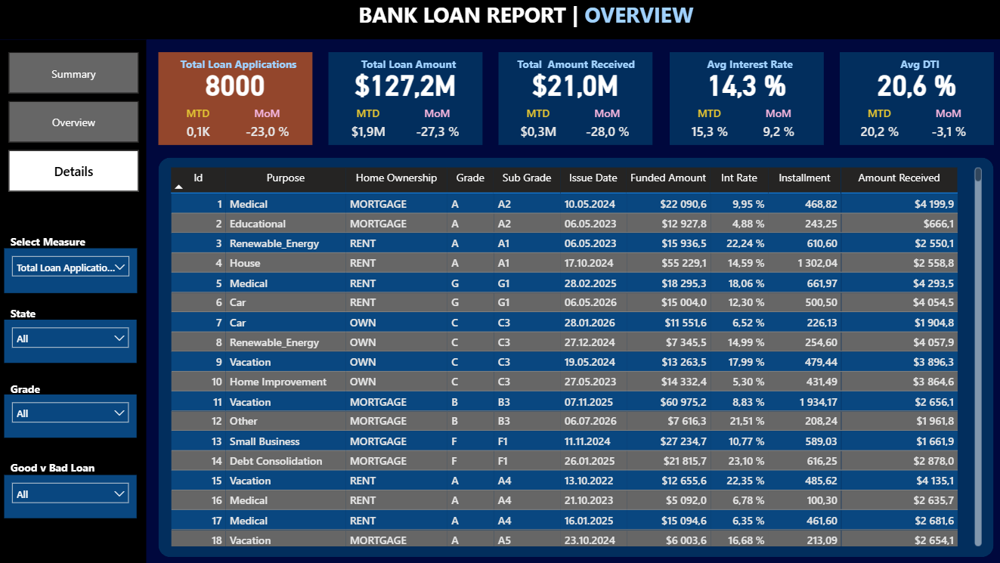
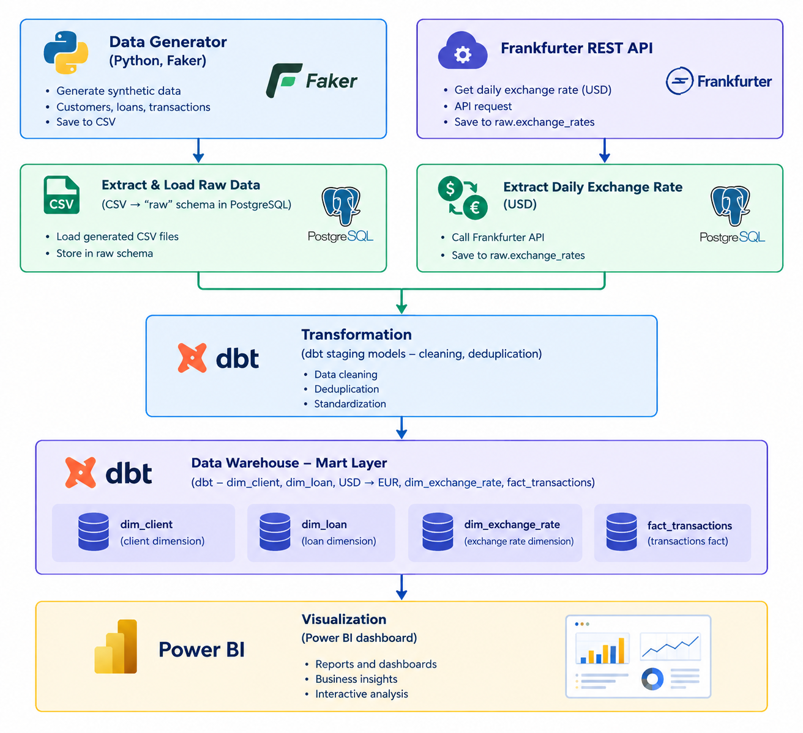

# End-to-End Loan Data Pipeline


[](https://github.com/paget82/loan-data-pipeline/actions/workflows/ci.yml)


## Problem
A lending company's data team had no automated, production-style way to move
loan and transaction data from source systems into a data warehouse. Reports
were built ad hoc on top of raw exports, transformations were undocumented
and hard to repeat, and there was no scheduled process or data quality
checks — every refresh required manual work and carried risk of silent
errors reaching the dashboards.

## Solution
I built an end-to-end batch data pipeline that generates, extracts,
transforms, and models loan and transaction data, fully orchestrated by
Apache Airflow. Raw data lands in PostgreSQL, dbt transforms it through a
staging layer (cleaning, deduplication, type casting) into a dimensional
mart layer (fact/dim model), and automated data quality tests run on every
build. The whole pipeline is scheduled to run daily without manual
intervention, and Power BI connects directly to the mart layer for
reporting.

## Tech Stack
- Python (Faker, Pandas, SQLAlchemy, Requests)
- PostgreSQL
- dbt (dbt-core, dbt-postgres, dbt_utils)
- Apache Airflow (LocalExecutor)
- External REST API integration (Frankfurter USD exchange rates)
- Docker / Docker Compose
- GitHub Actions (CI)
- Power BI

## Dataset
- Source: synthetic US-market data generated with Faker (`en_US` locale --
  no real customer data used), enriched with live daily USD-based
  exchange rates from the public Frankfurter REST API
- Tables: `clients` (~5,000 rows, US cities/states), `loans` (~8,000 rows,
  USD amounts), `transactions` (~60,000 rows, USD amounts),
  `exchange_rates` (~30 currencies vs. USD, refreshed daily)
- Intentionally includes "dirty" data — missing values, duplicates — to
  mirror real-world source system behavior

## Process
1. **Data generation** – a Python/Faker script generates realistic,
   linked clients/loans/transactions data with intentional data quality
   issues (missing income, missing interest rates, duplicate transactions).
2. **Extraction** – a Python script loads the raw CSVs into a `raw` schema
   in PostgreSQL, with no transformation applied at this stage. In
   parallel, a second extraction script calls the public **Frankfurter
   REST API** (`api.frankfurter.app`, no API key required) to pull the
   daily USD-based exchange rate fixing.
3. **Staging transformations (dbt)** – cleaning, deduplication, null
   handling, and explicit type casting, one model per source table
   (`stg_clients`, `stg_loans`, `stg_transactions`).
4. **Dimensional modeling (dbt)** – staging models are transformed into a
   fact/dim mart layer: `dim_client` (with age and credit tier),
   `dim_loan` (with term bucket and USD principal amount converted to EUR
   using the live exchange rate), `dim_exchange_rate`, and
   `fact_transactions`.
5. **Data quality testing (dbt)** – automated tests for uniqueness,
   not-null constraints, referential integrity between fact and dim
   tables, accepted value ranges, and accepted categorical values.
6. **Orchestration (Airflow)** – a daily DAG chains the whole flow:
   `generate_data → extract_to_raw → dbt_deps → dbt_run → dbt_test`,
   running inside a custom Airflow image with an isolated Python
   environment for dbt (to avoid dependency conflicts with Airflow's own
   SQLAlchemy version).
7. **Reporting** – Power BI connects to the mart layer in PostgreSQL
   (Import mode) for interactive dashboards.
8. **Continuous Integration (GitHub Actions)** – every push and pull
   request automatically spins up a disposable PostgreSQL instance,
   regenerates the data, loads it, runs `dbt run` and `dbt test`, and
   validates the Airflow DAG syntax and Dockerfile — catching broken
   models or DAGs before they ever reach a scheduled run.

## Results
The pipeline runs unattended on a daily schedule with full observability
through the Airflow UI — every run shows exactly which step succeeded or
failed, and automated data quality tests catch broken data before it
reaches a dashboard. What used to be a manual, error-prone refresh process
is now a repeatable, testable, and auditable pipeline that mirrors how a
production data engineering workflow is structured. The EUR conversion fed
by the live Frankfurter exchange rate was validated end-to-end in Power BI
— totals broken down by loan status show correctly scaled EUR figures
alongside the original USD amounts.

## Screenshots / Demo
<p align="center">
  
</p>

<p align="center">
  
</p>

<p align="center">
  
</p>

<p align="center">
  
</p>

<p align="center">
  
</p>


## How to run
1. Install Python dependencies: `pip install -r requirements.txt`
2. Build and start all services: `docker compose build && docker compose up -d`
3. Open the Airflow UI (`http://localhost:8090` by default — adjust the
   port in `docker-compose.yml` if needed), log in with `admin` / `admin`,
   enable the `loan_data_pipeline` DAG, and trigger a run.
4. Connect Power BI to `localhost:5432`, database `loan_dwh`, schema
   `marts`, using Import mode.

See the sections below for a manual (non-Airflow) run and further details.

## Files
- [`generator/generate_data.py`](generator/generate_data.py) – synthetic
  data generator
- [`extract/extract_to_raw.py`](extract/extract_to_raw.py) – raw data
  loader
- [`extract/extract_exchange_rates.py`](extract/extract_exchange_rates.py)
  – external REST API extractor (Frankfurter USD exchange rates)
- [`dbt_project/`](dbt_project/) – dbt staging and mart models, tests
- [`dags/loan_pipeline_dag.py`](dags/loan_pipeline_dag.py) – Airflow DAG
- [`docker-compose.yml`](docker-compose.yml) – full local infrastructure
- [`Dockerfile.airflow`](Dockerfile.airflow) – custom Airflow image with
  isolated dbt environment
- [`.github/workflows/ci.yml`](.github/workflows/ci.yml) – CI pipeline

## Business value
The pipeline eliminates manual, error-prone data refreshes and replaces
them with a scheduled, tested, and fully observable process — reducing the
risk of bad data reaching decision-makers and freeing up analyst time
previously spent on manual reporting upkeep. The same architecture pattern
(generate/extract → transform → test → orchestrate → report) scales
directly to real production data sources.

---

## Architecture

<p align="center">
  
</p>


The whole flow above is orchestrated by Airflow on a
daily schedule:
`generate_data -> extract_to_raw` and `extract_exchange_rates` (parallel)
`-> dbt_deps -> dbt_run -> dbt_test`.

## Why a custom Dockerfile for Airflow (`Dockerfile.airflow`)

`dbt-core` requires a different `sqlalchemy` version than the one Airflow
2.9.3 uses internally for its own ORM models. Installing packages directly
into the Airflow environment (e.g. via `_PIP_ADDITIONAL_REQUIREMENTS`)
breaks the Airflow webserver/scheduler. The fix: `Dockerfile.airflow`
creates a **separate virtual environment** (`/opt/dbt_venv`) just for dbt
and the pipeline scripts, completely isolated from Airflow's own Python
environment. The DAG calls `python`/`dbt` directly from this venv
(`/opt/dbt_venv/bin/...`).

## Manual run (without Airflow)

```bash
python generator/generate_data.py
cp .env.example .env   # edit if you changed the default credentials
python extract/extract_to_raw.py
python extract/extract_exchange_rates.py

cd dbt_project
cp profiles.yml.example profiles.yml
dbt deps
dbt run
dbt test
```

## External REST API integration

Alongside the synthetic clients/loans/transactions data, the pipeline
pulls **real, live data from a public third-party REST API**: the daily
USD-based currency exchange rate fixing published by Frankfurter (backed
by European Central Bank reference rates).

- Endpoint: `https://api.frankfurter.app/latest?from=USD`
- No API key or authentication required
- Updated once per ECB business day (weekends/holidays return the last
  valid rate)
- Script: [`extract/extract_exchange_rates.py`](extract/extract_exchange_rates.py)
- Lands in `raw.exchange_rates`, cleaned in `stg_exchange_rates`, exposed
  as `dim_exchange_rate`, and used to convert `dim_loan.principal_amount`
  into `principal_amount_eur`

The conversion uses a scalar subquery rather than a join, so a temporarily
unavailable API (e.g. the Frankfurter service is down) never drops loan
rows from `dim_loan` — it simply yields a null EUR amount for that run,
and normal USD reporting is unaffected.

In the Airflow DAG this runs as an independent `extract_exchange_rates`
task in parallel with `extract_to_raw`, since it doesn't depend on the
synthetic data generation step — both must finish before `dbt_deps` runs.

## Data model (mart layer)

| Table | Type | Description |
|---|---|---|
| `dim_client` | dimension | clients, credit tier, age |
| `dim_loan` | dimension | loans, term bucket, status, USD amount converted to EUR |
| `dim_exchange_rate` | dimension | daily USD-based currency fixing from the Frankfurter REST API |
| `fact_transactions` | fact | transactions linked to client and loan |

## Data quality

Tests in `dbt_project/models/marts/schema.yml` check:
- uniqueness and not-null constraints on primary keys
- referential integrity between fact and dim tables
- valid value ranges (credit_score, amount)
- accepted categorical values (loan status)

## Continuous Integration (CI)

Every push and pull request to `main` triggers `.github/workflows/ci.yml`,
which:

1. Spins up a disposable PostgreSQL 16 service container
2. Generates fresh synthetic data and loads it into `raw`
3. Runs `dbt deps`, `dbt run`, and `dbt test` against it
4. Validates that `dags/loan_pipeline_dag.py` compiles without errors
5. Lints `Dockerfile.airflow` with hadolint

This means a broken model, a failing data quality test, or a syntax error
in the DAG is caught automatically on every commit — before it could ever
reach the scheduled Airflow run in Phase 2. 


## Future improvements

This project intentionally stays scoped to a working end-to-end
demonstration. In a real production setting, the following would be the
next priorities:

- **Incremental dbt models** – `fact_transactions` currently rebuilds as a
  full table on every run; at production volume it would use
  `materialized='incremental'` with an `is_incremental()` filter on
  `transaction_date` instead of reprocessing the whole history each time.
- **Slowly Changing Dimensions (SCD Type 2)** – `dim_client` and `dim_loan`
  currently only hold the latest state. Tracking historical changes
  (e.g. a client's credit score or a loan's status over time) would need
  SCD Type 2 modeling, most likely via `dbt snapshot`.
- **Cloud-native target** – the warehouse currently runs on a local
  PostgreSQL instance for simplicity. A production deployment would target
  a cloud data warehouse (e.g. BigQuery, Snowflake, or Redshift) with the
  raw data landing in object storage (S3/GCS) first.
- **Alerting on pipeline failure** – Airflow currently surfaces failures
  only in its own UI. A production setup would add failure notifications
  (Slack/email) on both DAG task failures and dbt test failures.
- **Secrets management** – credentials are currently passed via a local
  `.env` file. In production these would move to a managed secrets store
  (e.g. AWS Secrets Manager, HashiCorp Vault) instead of environment files.
- **Unit tests for the Python layer** – data quality is covered by dbt
  tests, but the generator and extraction scripts (`generate_data.py`,
  `extract_exchange_rates.py`) have no dedicated unit tests (e.g. verifying
  the amortization formula, retry/backoff logic, or UUID determinism).
- **dbt docs / lineage** – `dbt docs generate` would produce an interactive
  lineage graph and column-level documentation, useful for onboarding and
  impact analysis, and could be published via GitHub Pages.