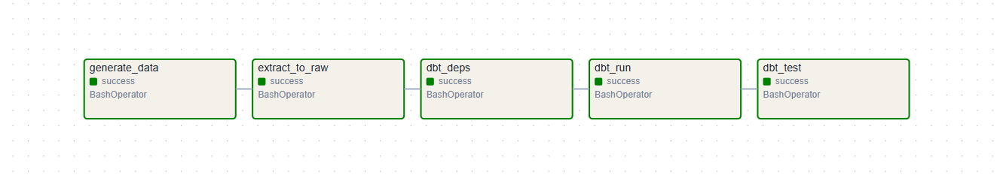
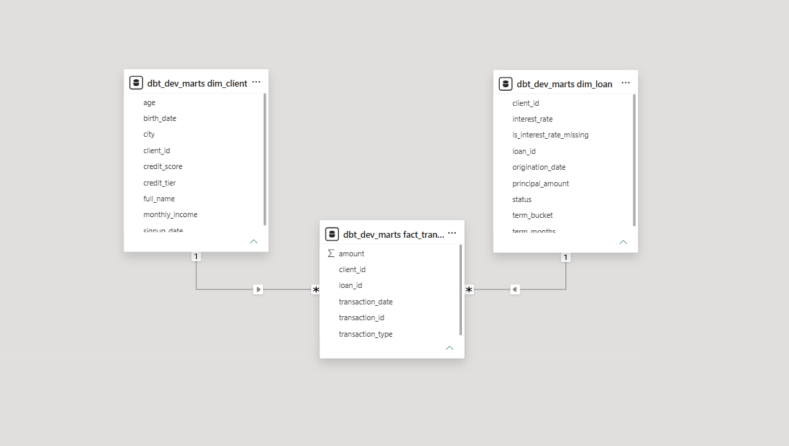

# Loan Data Pipeline
*Originally built as: Datová pipeline pro úvěrové transakce*

[](https://github.com/YOUR_USERNAME/loan-data-pipeline/actions/workflows/ci.yml)

## Problem
A lending company's data team had no automated, production-style way to move
loan and transaction data from source systems into a data warehouse. Reports
were built ad hoc on top of raw exports, transformations were undocumented
and hard to repeat, and there was no scheduled process or data quality
checks — every refresh required manual work and carried risk of silent
errors reaching the dashboards.

## Solution
I built an end-to-end batch data pipeline that generates, extracts,
transforms, and models loan and transaction data, fully orchestrated by
Apache Airflow. Raw data lands in PostgreSQL, dbt transforms it through a
staging layer (cleaning, deduplication, type casting) into a dimensional
mart layer (fact/dim model), and automated data quality tests run on every
build. The whole pipeline is scheduled to run daily without manual
intervention, and Power BI connects directly to the mart layer for
reporting.

## Tech Stack
- Python (Faker, Pandas, SQLAlchemy)
- PostgreSQL
- dbt (dbt-core, dbt-postgres, dbt_utils)
- Apache Airflow (LocalExecutor)
- Docker / Docker Compose
- GitHub Actions (CI)
- Power BI

## Dataset
- Source: synthetic data generated with Faker (no real customer data used)
- Tables: `clients` (~5,000 rows), `loans` (~8,000 rows), `transactions`
  (~60,000 rows)
- Intentionally includes "dirty" data — missing values, duplicates — to
  mirror real-world source system behavior

## Process
1. **Data generation** – a Python/Faker script generates realistic,
   linked clients/loans/transactions data with intentional data quality
   issues (missing income, missing interest rates, duplicate transactions).
2. **Extraction** – a Python script loads the raw CSVs into a `raw` schema
   in PostgreSQL, with no transformation applied at this stage.
3. **Staging transformations (dbt)** – cleaning, deduplication, null
   handling, and explicit type casting, one model per source table
   (`stg_clients`, `stg_loans`, `stg_transactions`).
4. **Dimensional modeling (dbt)** – staging models are transformed into a
   fact/dim mart layer: `dim_client` (with age and credit tier),
   `dim_loan` (with term bucket), and `fact_transactions`.
5. **Data quality testing (dbt)** – automated tests for uniqueness,
   not-null constraints, referential integrity between fact and dim
   tables, accepted value ranges, and accepted categorical values.
6. **Orchestration (Airflow)** – a daily DAG chains the whole flow:
   `generate_data → extract_to_raw → dbt_deps → dbt_run → dbt_test`,
   running inside a custom Airflow image with an isolated Python
   environment for dbt (to avoid dependency conflicts with Airflow's own
   SQLAlchemy version).
7. **Reporting** – Power BI connects to the mart layer in PostgreSQL
   (Import mode) for interactive dashboards.
8. **Continuous Integration (GitHub Actions)** – every push and pull
   request automatically spins up a disposable PostgreSQL instance,
   regenerates the data, loads it, runs `dbt run` and `dbt test`, and
   validates the Airflow DAG syntax and Dockerfile — catching broken
   models or DAGs before they ever reach a scheduled run.

## Results
The pipeline runs unattended on a daily schedule with full observability
through the Airflow UI — every run shows exactly which step succeeded or
failed, and automated data quality tests catch broken data before it
reaches a dashboard. What used to be a manual, error-prone refresh process
is now a repeatable, testable, and auditable pipeline that mirrors how a
production data engineering workflow is structured.

## Screenshots / Demo



## How to run
1. Install Python dependencies: `pip install -r requirements.txt`
2. Build and start all services: `docker compose build && docker compose up -d`
3. Open the Airflow UI (`http://localhost:8090` by default — adjust the
   port in `docker-compose.yml` if needed), log in with `admin` / `admin`,
   enable the `loan_data_pipeline` DAG, and trigger a run.
4. Connect Power BI to `localhost:5432`, database `loan_dwh`, schema
   `marts`, using Import mode.

See the sections below for a manual (non-Airflow) run and further details.

## Files
- [`generator/generate_data.py`](generator/generate_data.py) – synthetic
  data generator
- [`extract/extract_to_raw.py`](extract/extract_to_raw.py) – raw data
  loader
- [`dbt_project/`](dbt_project/) – dbt staging and mart models, tests
- [`dags/loan_pipeline_dag.py`](dags/loan_pipeline_dag.py) – Airflow DAG
- [`docker-compose.yml`](docker-compose.yml) – full local infrastructure
- [`Dockerfile.airflow`](Dockerfile.airflow) – custom Airflow image with
  isolated dbt environment

## Business value
The pipeline eliminates manual, error-prone data refreshes and replaces
them with a scheduled, tested, and fully observable process — reducing the
risk of bad data reaching decision-makers and freeing up analyst time
previously spent on manual reporting upkeep. The same architecture pattern
(generate/extract → transform → test → orchestrate → report) scales
directly to real production data sources.

---

## Architecture

```
Data generator (Python, Faker)
        |
        v
Extraction & storage of raw data (CSV -> "raw" schema in PostgreSQL)
        |
        v
Transformation (dbt staging models -- cleaning, deduplication)
        |
        v
Data warehouse -- mart layer (dbt -- dim_client, dim_loan, fact_transactions)
        |
        v
Visualization (Power BI dashboard)
```

From Phase 2 onward, the whole flow above is orchestrated by Airflow on a
daily schedule:
`generate_data -> extract_to_raw -> dbt_deps -> dbt_run -> dbt_test`.

## Why a custom Dockerfile for Airflow (`Dockerfile.airflow`)

`dbt-core` requires a different `sqlalchemy` version than the one Airflow
2.9.3 uses internally for its own ORM models. Installing packages directly
into the Airflow environment (e.g. via `_PIP_ADDITIONAL_REQUIREMENTS`)
breaks the Airflow webserver/scheduler. The fix: `Dockerfile.airflow`
creates a **separate virtual environment** (`/opt/dbt_venv`) just for dbt
and the pipeline scripts, completely isolated from Airflow's own Python
environment. The DAG calls `python`/`dbt` directly from this venv
(`/opt/dbt_venv/bin/...`).

## Manual run (without Airflow)

```bash
python generator/generate_data.py
cp .env.example .env   # edit if you changed the default credentials
python extract/extract_to_raw.py

cd dbt_project
cp profiles.yml.example profiles.yml
dbt deps
dbt run
dbt test
```

## Data model (mart layer)

| Table | Type | Description |
|---|---|---|
| `dim_client` | dimension | clients, credit tier, age |
| `dim_loan` | dimension | loans, term bucket, status |
| `fact_transactions` | fact | transactions linked to client and loan |

## Data quality

Tests in `dbt_project/models/marts/schema.yml` check:
- uniqueness and not-null constraints on primary keys
- referential integrity between fact and dim tables
- valid value ranges (credit_score, amount)
- accepted categorical values (loan status)

## Continuous Integration (CI)

Every push and pull request to `main` triggers `.github/workflows/ci.yml`,
which:

1. Spins up a disposable PostgreSQL 16 service container
2. Generates fresh synthetic data and loads it into `raw`
3. Runs `dbt deps`, `dbt run`, and `dbt test` against it
4. Validates that `dags/loan_pipeline_dag.py` compiles without errors
5. Lints `Dockerfile.airflow` with hadolint

This means a broken model, a failing data quality test, or a syntax error
in the DAG is caught automatically on every commit — before it could ever
reach the scheduled Airflow run in Phase 2. Replace `YOUR_USERNAME` in the
badge URL at the top of this file with your actual GitHub username/org
once the repo is pushed, so the badge renders correctly.

## Planned next phases

- Phase 3 – a Kafka streaming branch (producer/consumer simulating new
  transactions in real time)
- Phase 4 – extended dimensional model, Terraform for cloud infrastructure
